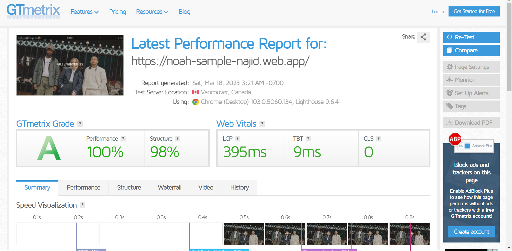
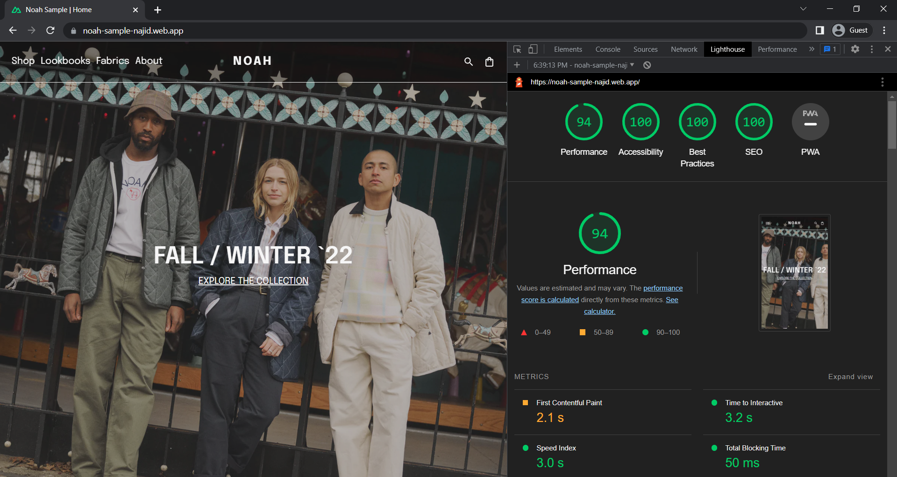

# NOAH E-commerce Redesign

This repository contains a live web example of a redesign concept found on [Behance](https://www.behance.net/gallery/162912947/NOAH-E-commerce-redesign?tracking_source=search_projects%7CEcommerce+noah). Live website is [here](https://noah-sample-najid.web.app/)

## Features

- Hover transition
- Simple enter animation
- Locomotive scroll
- Huge performance boost
- Comprehensive SEO implementations
- Firebase integrations
- Mobile Responsive

## Usage

To view the live demo, visit [https://noah-sample-najid.web.app](https://noah-sample-najid.web.app).

To clone the repository and run the project locally, use the following commands:
```
git clone https://github.com/Najidnadri/noah_sample.git
cd noah_sample
npm install
npm generate
npm preview
```

## BENCHMARK

### GTMetrix


### Lighthouse


## Copywrite

I do not own any copywrite inside this website sample.
